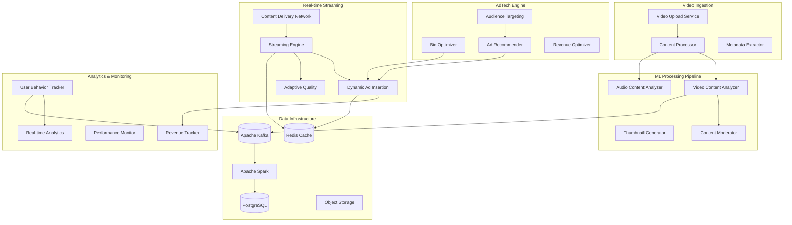

# 🎥 Video Streaming & AdTech MLOps Platform

## Production-Grade ML Infrastructure for Video Content and Advertising

**Duration:** 4-5 days | **Difficulty:** Expert  
**Tech Stack:** Python, FastAPI, Apache Kafka, Redis, PostgreSQL, Apache Spark, Docker, Kubernetes, TensorFlow, PyTorch

---

## 📋 **Project Overview**

This project implements a comprehensive **Video Streaming & AdTech MLOps Platform** designed for real-time video content analysis, personalized ad serving, and revenue optimization. The platform combines advanced computer vision, NLP, and recommendation systems to deliver intelligent video streaming experiences.

### **What This Platform Does**

The platform provides end-to-end ML capabilities for video streaming services:
- **Content Analysis** - Automated video classification, scene detection, and content moderation
- **Personalized Recommendations** - AI-driven content recommendations and user behavior prediction
- **Dynamic Ad Insertion** - Real-time ad placement optimization and audience targeting
- **Revenue Optimization** - Bid optimization, yield management, and performance analytics
- **Real-time Analytics** - Live monitoring of engagement, conversion, and revenue metrics

---

## 🏗️ **Architecture Overview**



---

## 🎯 **Key Features**

### **Video Content Intelligence**
- ✅ **Automated Content Classification** - Genre, mood, and theme detection
- ✅ **Scene and Object Detection** - Frame-level analysis for targeted advertising
- ✅ **Audio Content Analysis** - Music genre, speech recognition, and sentiment analysis
- ✅ **Content Moderation** - Automated detection of inappropriate content
- ✅ **Thumbnail Generation** - AI-powered thumbnail selection and generation

### **Personalization Engine**
- ✅ **User Behavior Modeling** - Real-time user preference learning
- ✅ **Content Recommendations** - Collaborative and content-based filtering
- ✅ **Viewing Pattern Analysis** - Engagement prediction and churn prevention
- ✅ **Dynamic Content Curation** - Personalized playlists and content discovery

### **AdTech Optimization**
- ✅ **Real-time Bid Optimization** - ML-driven bidding strategies
- ✅ **Audience Segmentation** - Dynamic user clustering and targeting
- ✅ **Ad Creative Optimization** - A/B testing and performance optimization
- ✅ **Revenue Maximization** - Yield management and inventory optimization
- ✅ **Fraud Detection** - Real-time ad fraud prevention

### **Streaming Intelligence**
- ✅ **Adaptive Bitrate Optimization** - ML-driven quality adjustment
- ✅ **CDN Optimization** - Intelligent content distribution
- ✅ **Buffering Prediction** - Proactive quality adjustment
- ✅ **Engagement Analytics** - Real-time viewer engagement tracking

---

## 📁 **Project Structure**

```
project3_video_adtech_platform/
├── README.md                              # This file
├── docs/                                  # Documentation
│   ├── architecture.md                   # System architecture
│   ├── ml-models.md                     # ML model specifications
│   ├── api-reference.md                 # API documentation
│   └── deployment.md                    # Deployment guide
├── src/                                  # Source code
│   ├── video_processing/                 # Video content processing
│   │   ├── __init__.py
│   │   ├── content_analyzer.py           # Video content analysis
│   │   ├── audio_processor.py            # Audio content processing
│   │   ├── thumbnail_generator.py        # Thumbnail generation
│   │   ├── content_moderator.py          # Content moderation
│   │   └── metadata_extractor.py         # Metadata extraction
│   ├── streaming/                        # Streaming infrastructure
│   │   ├── __init__.py
│   │   ├── streaming_engine.py           # Core streaming engine
│   │   ├── adaptive_quality.py           # Adaptive bitrate logic
│   │   ├── cdn_optimizer.py              # CDN optimization
│   │   └── session_manager.py            # Streaming session management
│   ├── adtech/                           # AdTech engine
│   │   ├── __init__.py
│   │   ├── bid_optimizer.py              # Real-time bid optimization
│   │   ├── audience_targeting.py         # Audience segmentation
│   │   ├── ad_recommender.py             # Ad recommendation engine
│   │   ├── revenue_optimizer.py          # Revenue optimization
│   │   ├── fraud_detector.py             # Ad fraud detection
│   │   └── insertion_engine.py           # Dynamic ad insertion
│   ├── recommendations/                  # Recommendation system
│   │   ├── __init__.py
│   │   ├── content_recommender.py        # Content recommendation
│   │   ├── user_modeling.py              # User behavior modeling
│   │   ├── collaborative_filtering.py    # Collaborative filtering
│   │   ├── content_based.py              # Content-based filtering
│   │   └── engagement_predictor.py       # Engagement prediction
│   ├── analytics/                        # Analytics engine
│   │   ├── __init__.py
│   │   ├── real_time_analytics.py        # Real-time analytics
│   │   ├── user_behavior_tracker.py      # User behavior tracking
│   │   ├── performance_monitor.py        # Performance monitoring
│   │   ├── revenue_tracker.py            # Revenue tracking
│   │   └── engagement_analyzer.py        # Engagement analysis
│   ├── ml_models/                        # ML model implementations
│   │   ├── __init__.py
│   │   ├── video_classifier.py           # Video classification models
│   │   ├── recommendation_models.py      # Recommendation models
│   │   ├── fraud_detection_models.py     # Fraud detection models
│   │   ├── engagement_models.py          # Engagement prediction models
│   │   └── model_serving.py              # Model serving infrastructure
│   ├── data_pipeline/                    # Data processing pipeline
│   │   ├── __init__.py
│   │   ├── kafka_producer.py             # Kafka event producer
│   │   ├── kafka_consumer.py             # Kafka event consumer
│   │   ├── spark_processor.py            # Spark data processing
│   │   ├── feature_engineering.py        # Feature engineering
│   │   └── data_validator.py             # Data validation
│   ├── api/                              # API services
│   │   ├── __init__.py
│   │   ├── video_api.py                  # Video management API
│   │   ├── streaming_api.py              # Streaming API
│   │   ├── adtech_api.py                 # AdTech API
│   │   ├── analytics_api.py              # Analytics API
│   │   └── recommendations_api.py        # Recommendations API
│   ├── infrastructure/                   # Infrastructure components
│   │   ├── __init__.py
│   │   ├── kafka_config.py               # Kafka configuration
│   │   ├── redis_client.py               # Redis client
│   │   ├── database.py                   # Database connections
│   │   ├── storage.py                    # Object storage client
│   │   └── monitoring.py                 # Monitoring setup
│   └── shared/                           # Shared utilities
│       ├── __init__.py
│       ├── config.py                     # Configuration management
│       ├── logging.py                    # Logging setup
│       ├── metrics.py                    # Metrics collection
│       └── utils.py                      # Utility functions
├── tests/                                # Test suites
│   ├── unit/                            # Unit tests
│   ├── integration/                     # Integration tests
│   ├── performance/                     # Performance tests
│   └── fixtures/                        # Test fixtures
├── deployment/                          # Deployment configurations
│   ├── kubernetes/                      # Kubernetes manifests
│   │   ├── namespace.yaml
│   │   ├── video-processing/            # Video processing services
│   │   ├── streaming/                   # Streaming services
│   │   ├── adtech/                      # AdTech services
│   │   ├── analytics/                   # Analytics services
│   │   └── infrastructure/              # Infrastructure services
│   ├── helm/                            # Helm charts
│   │   ├── video-adtech-platform/
│   │   └── monitoring/
│   ├── docker/                          # Docker configurations
│   │   ├── video-processor.Dockerfile
│   │   ├── streaming-engine.Dockerfile
│   │   ├── adtech-engine.Dockerfile
│   │   └── docker-compose.yml
│   └── terraform/                       # Infrastructure as Code
│       ├── main.tf
│       ├── variables.tf
│       └── outputs.tf
├── monitoring/                          # Monitoring & observability
│   ├── prometheus/                      # Prometheus configuration
│   ├── grafana/                         # Grafana dashboards
│   ├── alerting/                        # Alert rules
│   └── logging/                         # Log aggregation
├── ml_training/                         # ML model training
│   ├── notebooks/                       # Jupyter notebooks
│   ├── experiments/                     # ML experiments
│   ├── pipelines/                       # Training pipelines
│   └── models/                          # Trained model artifacts
├── data/                                # Data samples and schemas
│   ├── schemas/                         # Data schemas
│   ├── sample_videos/                   # Sample video files
│   └── test_data/                       # Test datasets
├── scripts/                             # Automation scripts
│   ├── setup.sh                         # Environment setup
│   ├── deploy.sh                        # Deployment script
│   ├── train_models.py                  # Model training script
│   └── data_ingestion.py                # Data ingestion script
├── .github/workflows/                   # CI/CD pipelines
│   ├── test.yml                         # Testing pipeline
│   ├── build.yml                        # Build pipeline
│   ├── deploy.yml                       # Deployment pipeline
│   └── ml-training.yml                  # ML training pipeline
├── requirements.txt                     # Python dependencies
├── requirements-dev.txt                 # Development dependencies
├── pyproject.toml                       # Python project configuration
├── Makefile                             # Development tasks
└── .env.example                         # Environment variables template
```

---

## 🚀 **Quick Start**

### **Prerequisites**
```bash
# Required tools
- Python 3.9+
- Docker & Docker Compose
- Kubernetes cluster (local or cloud)
- Apache Kafka
- Redis
- PostgreSQL
- Apache Spark
- FFmpeg (for video processing)
```

### **1. Clone and Setup**
```bash
# Clone the repository
git clone <repository-url>
cd project3_video_adtech_platform

# Setup Python environment
python -m venv venv
source venv/bin/activate  # On Windows: venv\Scripts\activate
pip install -r requirements.txt

# Setup environment variables
cp .env.example .env
# Edit .env with your configuration
```

### **2. Start Infrastructure Services**
```bash
# Start infrastructure services
docker-compose up -d kafka redis postgres

# Start Spark cluster
docker-compose up -d spark-master spark-worker

# Initialize databases
python scripts/init_database.py

# Setup Kafka topics
python scripts/setup_kafka_topics.py
```

### **3. Start Core Services**
```bash
# Start video processing service
python -m src.video_processing.content_analyzer

# Start streaming engine
python -m src.streaming.streaming_engine

# Start AdTech engine
python -m src.adtech.bid_optimizer

# Start analytics engine
python -m src.analytics.real_time_analytics

# Start API gateway
python -m src.api.main
```

### **4. Test the Platform**
```bash
# Upload test video
curl -X POST "http://localhost:8000/api/videos/upload" \
  -F "file=@data/sample_videos/test_video.mp4" \
  -F "metadata={\"title\":\"Test Video\",\"category\":\"entertainment\"}"

# Start streaming session
curl -X POST "http://localhost:8000/api/streaming/start" \
  -H "Content-Type: application/json" \
  -d '{"video_id":"test_video_id","user_id":"user_123"}'

# Get recommendations
curl "http://localhost:8000/api/recommendations/user/user_123"
```

---

## 🔧 **Core Components**

### **1. Video Content Processing**
Advanced video analysis pipeline for content understanding and optimization.

**Key Features:**
- Multi-model video classification (genre, mood, themes)
- Frame-level object and scene detection
- Audio content analysis and music recognition
- Automated content moderation and safety scoring
- AI-powered thumbnail generation and optimization

### **2. Real-time Streaming Engine**
High-performance streaming infrastructure with adaptive optimization.

**Key Features:**
- Adaptive bitrate streaming with ML-driven quality optimization
- CDN-aware content distribution and caching strategies
- Real-time session management and viewer analytics
- Buffering prediction and proactive quality adjustment
- Multi-device streaming optimization

### **3. AdTech Optimization Engine**
Advanced advertising technology with ML-driven optimization.

**Key Features:**
- Real-time bid optimization using reinforcement learning
- Dynamic audience segmentation and targeting
- Context-aware ad placement and creative optimization
- Revenue maximization through yield management
- Real-time fraud detection and prevention

### **4. Personalization & Recommendations**
Sophisticated recommendation system for content discovery.

**Key Features:**
- Hybrid recommendation combining collaborative and content-based filtering
- Real-time user behavior modeling and preference learning
- Engagement prediction and churn prevention
- Dynamic playlist generation and content curation
- A/B testing framework for recommendation optimization

### **5. Real-time Analytics**
Comprehensive analytics and monitoring for data-driven decisions.

**Key Features:**
- Real-time viewer engagement and behavior tracking
- Performance monitoring and quality metrics
- Revenue tracking and optimization insights
- Predictive analytics for content and ad performance
- Custom dashboard and alerting systems

---

## 📊 **ML Models & Algorithms**

### **Video Analysis Models**
- **Video Classification**: ResNet-based CNN for genre and theme classification
- **Scene Detection**: LSTM-CNN hybrid for temporal scene segmentation
- **Object Detection**: YOLO v8 for real-time object detection in frames
- **Content Moderation**: Multi-modal transformer for safety classification

### **Recommendation Models**
- **Collaborative Filtering**: Matrix factorization with neural collaborative filtering
- **Content-Based**: BERT embeddings with deep content understanding
- **Sequential Models**: Transformer-based models for viewing sequence prediction
- **Cold Start**: Meta-learning approaches for new user/content recommendations

### **AdTech Models**
- **Bid Optimization**: Deep Q-Network (DQN) for real-time bidding
- **CTR Prediction**: DeepFM model for click-through rate prediction
- **Audience Targeting**: Clustering and lookalike modeling
- **Fraud Detection**: Isolation Forest and neural anomaly detection

### **Engagement Models**
- **Watch Time Prediction**: XGBoost with engineered temporal features
- **Completion Rate**: Neural networks with attention mechanisms
- **Churn Prediction**: Ensemble methods with temporal modeling
- **Quality of Experience**: Multi-objective optimization models

---

## 🎯 **Business Metrics & KPIs**

### **Content Performance**
- Video engagement rates and completion metrics
- Content discovery and recommendation effectiveness
- User satisfaction and retention rates
- Content quality and moderation accuracy

### **Advertising Performance**
- Ad revenue per session and per user
- Click-through rates and conversion metrics
- Bid win rates and cost optimization
- Fraud detection accuracy and prevention

### **Technical Performance**
- Streaming quality and buffering rates
- CDN efficiency and cost optimization
- Model inference latency and accuracy
- System availability and scalability metrics

---

## 🏭 **Production Deployment**

### **Kubernetes Production**
```bash
# Deploy with Helm
helm install video-adtech-platform ./deployment/helm/video-adtech-platform

# Monitor deployment
kubectl get pods -n video-adtech-platform
kubectl logs -f deployment/streaming-engine
```

### **Auto-scaling Configuration**
```yaml
# Horizontal Pod Autoscaler
apiVersion: autoscaling/v2
kind: HorizontalPodAutoscaler
metadata:
  name: streaming-engine-hpa
spec:
  scaleTargetRef:
    apiVersion: apps/v1
    kind: Deployment
    name: streaming-engine
  minReplicas: 3
  maxReplicas: 100
  metrics:
  - type: Resource
    resource:
      name: cpu
      target:
        type: Utilization
        averageUtilization: 70
  - type: Resource
    resource:
      name: memory
      target:
        type: Utilization
        averageUtilization: 80
```

### **Monitoring & Alerting**
```bash
# Deploy monitoring stack
helm install monitoring ./deployment/helm/monitoring

# Access Grafana dashboard
kubectl port-forward svc/grafana 3000:80

# View real-time metrics
open http://localhost:3000
```

---

## 🧪 **Testing & Validation**

### **Performance Testing**
```bash
# Load test streaming endpoints
python tests/performance/streaming_load_test.py

# Test ad insertion performance
python tests/performance/adtech_performance_test.py

# Validate ML model accuracy
python tests/ml/model_validation_test.py
```

### **A/B Testing Framework**
```python
# Example A/B test configuration
ab_test_config = {
    "experiment_name": "recommendation_algorithm_v2",
    "traffic_split": {"control": 0.5, "treatment": 0.5},
    "metrics": ["engagement_rate", "session_duration", "revenue_per_user"],
    "duration_days": 14,
    "minimum_sample_size": 10000
}
```

---

## 🎓 **Learning Outcomes**

By building this project, you'll master:

### **Video Streaming Technology**
- Video processing and encoding optimization
- Adaptive streaming and quality optimization
- CDN integration and content distribution
- Real-time streaming infrastructure design

### **AdTech & Monetization**
- Programmatic advertising and real-time bidding
- Audience targeting and segmentation strategies
- Revenue optimization and yield management
- Ad fraud detection and prevention techniques

### **Advanced ML Engineering**
- Multi-modal AI for video and audio processing
- Real-time recommendation systems at scale
- Reinforcement learning for optimization
- MLOps for video and advertising workloads

### **Production Engineering**
- High-throughput data pipeline design
- Real-time analytics and monitoring
- Microservices architecture for media platforms
- Auto-scaling and cost optimization strategies

---

## 🔗 **Integration Examples**

### **Video Upload & Processing**
```python
# Upload video with automatic processing
import requests

response = requests.post(
    "http://localhost:8000/api/videos/upload",
    files={"file": open("video.mp4", "rb")},
    data={"metadata": json.dumps({
        "title": "Product Demo",
        "category": "business",
        "target_audience": ["tech_professionals", "business_owners"]
    })}
)

video_id = response.json()["video_id"]
print(f"Video uploaded: {video_id}")
```

### **Real-time Streaming Session**
```python
# Start optimized streaming session
streaming_session = await streaming_engine.start_session(
    video_id="demo_video_123",
    user_id="user_456",
    device_info={
        "type": "mobile",
        "screen_resolution": "1080p",
        "bandwidth": "4G"
    },
    ad_preferences={
        "max_ad_frequency": 2,
        "preferred_categories": ["technology", "business"]
    }
)
```

### **Dynamic Ad Insertion**
```python
# Real-time ad optimization
ad_opportunity = {
    "session_id": streaming_session.id,
    "content_context": video_metadata,
    "user_profile": user_preferences,
    "ad_slot_duration": 30,
    "placement_type": "mid_roll"
}

optimal_ad = await ad_optimizer.get_optimal_ad(ad_opportunity)
await ad_insertion_engine.insert_ad(optimal_ad)
```

---

## 📈 **Scalability & Performance**

### **Throughput Targets**
- **Concurrent Streams**: 100,000+ simultaneous viewers
- **Video Processing**: 1,000+ videos per hour
- **Ad Requests**: 1,000,000+ requests per second
- **Recommendation Latency**: <50ms p99

### **Cost Optimization**
- Intelligent CDN usage and caching strategies
- Auto-scaling based on demand patterns
- ML-driven resource allocation
- Multi-cloud cost optimization

---

## 🤝 **Contributing**

This project follows production-grade development practices:
- Comprehensive test coverage (>90%)
- Type hints and documentation
- CI/CD with automated testing
- Security scanning and performance monitoring

Ready to build the future of video streaming and advertising technology? Let's get started! 🚀

---

## 🎉 **Next Steps**

1. **[Quick Start](#quick-start)** - Get the platform running locally
2. **[Deploy ML Models](#ml-models--algorithms)** - Train and deploy video analysis models
3. **[Configure AdTech](#adtech-optimization-engine)** - Set up advertising optimization
4. **[Scale to Production](#production-deployment)** - Deploy to production environment

Transform your video streaming platform with AI-powered content analysis, personalized recommendations, and optimized advertising! 🎬✨