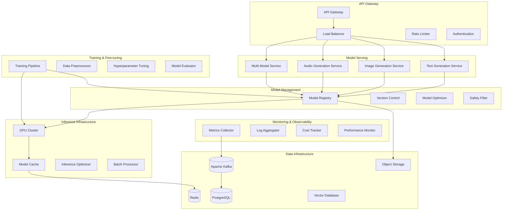

# 🤖 Generative AI MLOps Platform

## Production-Grade Infrastructure for Large Language Models and Generative AI

**Duration:** 5-6 days | **Difficulty:** Expert  
**Tech Stack:** Python, PyTorch, Transformers, FastAPI, Ray, Kubernetes, Redis, PostgreSQL, Apache Kafka, Docker

---

## 📋 **Project Overview**

This project implements a comprehensive **Generative AI MLOps Platform** designed for deploying, scaling, and managing large language models (LLMs) and other generative AI systems in production. The platform provides end-to-end lifecycle management for generative AI applications with enterprise-grade reliability, scalability, and cost optimization.

### **What This Platform Does**

The platform enables organizations to:
- **Deploy LLMs at Scale** - Efficient serving of large language models with auto-scaling
- **Multi-Modal Generation** - Text, image, audio, and video generation capabilities
- **Fine-tuning Pipeline** - Automated fine-tuning and adaptation of pre-trained models
- **Safety & Governance** - Content filtering, bias detection, and ethical AI compliance
- **Cost Optimization** - Intelligent resource allocation and cost management for GPU workloads

---

## 🏗️ **Architecture Overview**



---

## 🎯 **Key Features**

### **Model Serving & Inference**
- ✅ **Multi-Model Serving** - Concurrent serving of multiple LLMs and generative models
- ✅ **Dynamic Batching** - Intelligent request batching for optimal throughput
- ✅ **Model Optimization** - Quantization, pruning, and distillation for efficiency
- ✅ **Auto-scaling** - GPU resource scaling based on demand and cost constraints
- ✅ **A/B Testing** - Comparative testing of model versions and configurations

### **Generative AI Capabilities**
- ✅ **Text Generation** - LLM inference with custom prompting and fine-tuning
- ✅ **Image Generation** - Stable Diffusion and custom image models
- ✅ **Audio Generation** - Voice synthesis and music generation
- ✅ **Multi-Modal** - Vision-language models and cross-modal generation
- ✅ **Code Generation** - Programming assistance and code completion

### **Training & Fine-tuning**
- ✅ **Distributed Training** - Multi-GPU and multi-node training orchestration
- ✅ **Parameter-Efficient Fine-tuning** - LoRA, AdaLoRA, and prefix tuning
- ✅ **Instruction Tuning** - Custom instruction following and task adaptation
- ✅ **RLHF Integration** - Reinforcement Learning from Human Feedback
- ✅ **Automated Hyperparameter Optimization** - Efficient hyperparameter search

### **Safety & Governance**
- ✅ **Content Filtering** - Real-time content moderation and safety checks
- ✅ **Bias Detection** - Automated bias detection and mitigation
- ✅ **Ethical AI Compliance** - Governance frameworks and audit trails
- ✅ **Privacy Protection** - Data anonymization and differential privacy
- ✅ **Usage Monitoring** - Comprehensive usage tracking and compliance

### **Production Engineering**
- ✅ **High Availability** - Fault-tolerant model serving with failover
- ✅ **Cost Optimization** - GPU utilization optimization and cost tracking
- ✅ **Performance Monitoring** - Real-time inference metrics and alerting
- ✅ **Resource Management** - Intelligent GPU allocation and scheduling
- ✅ **Security** - End-to-end encryption and secure model deployment

---

## 📁 **Project Structure**

```
project4_genai_mlops_platform/
├── README.md                              # This file
├── docs/                                  # Documentation
│   ├── architecture.md                   # System architecture
│   ├── model-deployment.md              # Model deployment guide
│   ├── fine-tuning.md                   # Fine-tuning guide
│   ├── safety-guidelines.md             # AI safety guidelines
│   └── api-reference.md                 # API documentation
├── src/                                  # Source code
│   ├── serving/                          # Model serving infrastructure
│   │   ├── __init__.py
│   │   ├── text_generation/              # Text generation service
│   │   │   ├── __init__.py
│   │   │   ├── llm_server.py             # LLM serving engine
│   │   │   ├── prompt_processor.py       # Prompt processing
│   │   │   ├── response_formatter.py     # Response formatting
│   │   │   └── streaming_handler.py      # Streaming responses
│   │   ├── image_generation/             # Image generation service
│   │   │   ├── __init__.py
│   │   │   ├── diffusion_server.py       # Stable Diffusion server
│   │   │   ├── image_processor.py        # Image processing
│   │   │   ├── style_transfer.py         # Style transfer models
│   │   │   └── upscaling_service.py      # Image upscaling
│   │   ├── audio_generation/             # Audio generation service
│   │   │   ├── __init__.py
│   │   │   ├── tts_server.py             # Text-to-speech
│   │   │   ├── music_generator.py        # Music generation
│   │   │   ├── voice_cloning.py          # Voice cloning
│   │   │   └── audio_processor.py        # Audio processing
│   │   ├── multimodal/                   # Multi-modal services
│   │   │   ├── __init__.py
│   │   │   ├── vision_language.py        # Vision-language models
│   │   │   ├── cross_modal.py            # Cross-modal generation
│   │   │   └── unified_interface.py      # Unified API interface
│   │   └── model_optimizer.py            # Model optimization engine
│   ├── training/                         # Training infrastructure
│   │   ├── __init__.py
│   │   ├── fine_tuning/                  # Fine-tuning pipeline
│   │   │   ├── __init__.py
│   │   │   ├── lora_trainer.py           # LoRA fine-tuning
│   │   │   ├── instruction_tuner.py      # Instruction tuning
│   │   │   ├── rlhf_trainer.py           # RLHF training
│   │   │   └── data_processor.py         # Training data processing
│   │   ├── distributed/                  # Distributed training
│   │   │   ├── __init__.py
│   │   │   ├── trainer_coordinator.py    # Training coordination
│   │   │   ├── gradient_sync.py          # Gradient synchronization
│   │   │   └── resource_manager.py       # Resource management
│   │   ├── evaluation/                   # Model evaluation
│   │   │   ├── __init__.py
│   │   │   ├── benchmark_runner.py       # Benchmark execution
│   │   │   ├── safety_evaluator.py       # Safety evaluation
│   │   │   ├── bias_detector.py          # Bias detection
│   │   │   └── performance_metrics.py    # Performance metrics
│   │   └── hyperparameter_optimization.py # HPO engine
│   ├── model_management/                 # Model lifecycle management
│   │   ├── __init__.py
│   │   ├── registry/                     # Model registry
│   │   │   ├── __init__.py
│   │   │   ├── model_store.py            # Model storage
│   │   │   ├── version_manager.py        # Version management
│   │   │   ├── metadata_manager.py       # Metadata management
│   │   │   └── lineage_tracker.py        # Model lineage
│   │   ├── deployment/                   # Model deployment
│   │   │   ├── __init__.py
│   │   │   ├── deployer.py               # Model deployment engine
│   │   │   ├── canary_deployment.py      # Canary deployments
│   │   │   ├── rollback_manager.py       # Rollback management
│   │   │   └── health_checker.py         # Model health checks
│   │   ├── optimization/                 # Model optimization
│   │   │   ├── __init__.py
│   │   │   ├── quantization.py           # Model quantization
│   │   │   ├── pruning.py                # Model pruning
│   │   │   ├── distillation.py           # Knowledge distillation
│   │   │   └── tensorrt_optimizer.py     # TensorRT optimization
│   │   └── safety/                       # AI safety
│   │       ├── __init__.py
│   │       ├── content_filter.py         # Content filtering
│   │       ├── bias_mitigation.py        # Bias mitigation
│   │       ├── privacy_protection.py     # Privacy protection
│   │       └── governance_framework.py   # Governance framework
│   ├── infrastructure/                   # Infrastructure components
│   │   ├── __init__.py
│   │   ├── gpu_manager.py                # GPU resource management
│   │   ├── batch_processor.py            # Batch processing
│   │   ├── cache_manager.py              # Model caching
│   │   ├── queue_manager.py              # Request queue management
│   │   ├── load_balancer.py              # Load balancing
│   │   └── autoscaler.py                 # Auto-scaling engine
│   ├── monitoring/                       # Monitoring & observability
│   │   ├── __init__.py
│   │   ├── metrics_collector.py          # Metrics collection
│   │   ├── cost_tracker.py               # Cost tracking
│   │   ├── performance_monitor.py        # Performance monitoring
│   │   ├── usage_analytics.py            # Usage analytics
│   │   └── alerting_system.py            # Alerting system
│   ├── api/                              # API services
│   │   ├── __init__.py
│   │   ├── gateway.py                    # API gateway
│   │   ├── text_api.py                   # Text generation API
│   │   ├── image_api.py                  # Image generation API
│   │   ├── audio_api.py                  # Audio generation API
│   │   ├── multimodal_api.py             # Multi-modal API
│   │   └── management_api.py             # Model management API
│   ├── data/                             # Data management
│   │   ├── __init__.py
│   │   ├── processors/                   # Data processors
│   │   │   ├── __init__.py
│   │   │   ├── text_processor.py         # Text data processing
│   │   │   ├── image_processor.py        # Image data processing
│   │   │   ├── audio_processor.py        # Audio data processing
│   │   │   └── multimodal_processor.py   # Multi-modal processing
│   │   ├── loaders/                      # Data loaders
│   │   │   ├── __init__.py
│   │   │   ├── streaming_loader.py       # Streaming data loader
│   │   │   ├── batch_loader.py           # Batch data loader
│   │   │   └── distributed_loader.py     # Distributed loading
│   │   └── validation/                   # Data validation
│   │       ├── __init__.py
│   │       ├── schema_validator.py       # Schema validation
│   │       ├── quality_checker.py        # Data quality checks
│   │       └── privacy_scanner.py        # Privacy scanning
│   └── shared/                           # Shared utilities
│       ├── __init__.py
│       ├── config.py                     # Configuration management
│       ├── logging.py                    # Logging setup
│       ├── metrics.py                    # Metrics utilities
│       ├── security.py                   # Security utilities
│       └── utils.py                      # General utilities
├── tests/                                # Test suites
│   ├── unit/                            # Unit tests
│   ├── integration/                     # Integration tests
│   ├── performance/                     # Performance tests
│   ├── safety/                          # Safety tests
│   └── fixtures/                        # Test fixtures
├── deployment/                          # Deployment configurations
│   ├── kubernetes/                      # Kubernetes manifests
│   │   ├── namespace.yaml
│   │   ├── serving/                     # Serving services
│   │   ├── training/                    # Training services
│   │   ├── gpu-resources/               # GPU resource configs
│   │   ├── monitoring/                  # Monitoring stack
│   │   └── storage/                     # Storage configurations
│   ├── helm/                            # Helm charts
│   │   ├── genai-platform/
│   │   ├── model-serving/
│   │   └── training-pipeline/
│   ├── docker/                          # Docker configurations
│   │   ├── serving.Dockerfile
│   │   ├── training.Dockerfile
│   │   ├── gpu-optimized.Dockerfile
│   │   └── docker-compose.yml
│   └── terraform/                       # Infrastructure as Code
│       ├── aws/                         # AWS infrastructure
│       ├── gcp/                         # GCP infrastructure
│       └── azure/                       # Azure infrastructure
├── models/                              # Model configurations
│   ├── llm/                             # LLM configurations
│   │   ├── llama-configs/
│   │   ├── gpt-configs/
│   │   └── custom-configs/
│   ├── image/                           # Image model configs
│   │   ├── stable-diffusion/
│   │   ├── dalle-configs/
│   │   └── custom-image-models/
│   ├── audio/                           # Audio model configs
│   │   ├── tts-models/
│   │   ├── music-models/
│   │   └── voice-models/
│   └── multimodal/                      # Multi-modal configs
│       ├── vision-language/
│       └── cross-modal/
├── datasets/                            # Dataset management
│   ├── text/                            # Text datasets
│   ├── images/                          # Image datasets
│   ├── audio/                           # Audio datasets
│   ├── multimodal/                      # Multi-modal datasets
│   └── synthetic/                       # Synthetic datasets
├── scripts/                             # Automation scripts
│   ├── setup.sh                         # Environment setup
│   ├── deploy.sh                        # Deployment script
│   ├── train_model.py                   # Model training script
│   ├── benchmark.py                     # Benchmarking script
│   └── safety_audit.py                  # Safety audit script
├── monitoring/                          # Monitoring configurations
│   ├── prometheus/                      # Prometheus configs
│   ├── grafana/                         # Grafana dashboards
│   ├── alerting/                        # Alert rules
│   └── cost-monitoring/                 # Cost monitoring
├── .github/workflows/                   # CI/CD pipelines
│   ├── test.yml                         # Testing pipeline
│   ├── build-and-deploy.yml             # Build and deploy
│   ├── model-training.yml               # Model training pipeline
│   ├── safety-checks.yml                # Safety validation
│   └── cost-optimization.yml            # Cost optimization
├── requirements.txt                     # Python dependencies
├── requirements-gpu.txt                 # GPU-specific dependencies
├── pyproject.toml                       # Python project configuration
├── Makefile                             # Development tasks
└── .env.example                         # Environment variables template
```

---

## 🚀 **Quick Start**

### **Prerequisites**
```bash
# Required tools
- Python 3.9+
- CUDA 11.8+ (for GPU support)
- Docker & Docker Compose
- Kubernetes cluster with GPU nodes
- 16GB+ GPU memory (for larger models)
- High-speed internet (for model downloads)
```

### **1. Environment Setup**
```bash
# Clone the repository
git clone <repository-url>
cd project4_genai_mlops_platform

# Setup Python environment
python -m venv genai-env
source genai-env/bin/activate  # On Windows: genai-env\Scripts\activate

# Install dependencies
pip install -r requirements.txt
pip install -r requirements-gpu.txt  # For GPU support

# Setup environment variables
cp .env.example .env
# Edit .env with your configuration
```

### **2. Infrastructure Setup**
```bash
# Start infrastructure services
docker-compose up -d postgres redis kafka

# Initialize database
python scripts/init_database.py

# Setup model storage
python scripts/setup_model_storage.py

# Configure GPU resources
kubectl apply -f deployment/kubernetes/gpu-resources/
```

### **3. Deploy Base Models**
```bash
# Download and deploy base models
python scripts/deploy_base_models.py --models llama2,stable-diffusion

# Start model serving services
kubectl apply -f deployment/kubernetes/serving/

# Verify deployments
kubectl get pods -n genai-platform
```

### **4. Test the Platform**
```bash
# Test text generation
curl -X POST "http://localhost:8000/api/v1/generate/text" \
  -H "Content-Type: application/json" \
  -d '{"prompt": "Explain quantum computing", "max_tokens": 100}'

# Test image generation
curl -X POST "http://localhost:8000/api/v1/generate/image" \
  -H "Content-Type: application/json" \
  -d '{"prompt": "A futuristic city at sunset", "steps": 20}'

# Test audio generation
curl -X POST "http://localhost:8000/api/v1/generate/audio" \
  -H "Content-Type: application/json" \
  -d '{"text": "Hello, this is a test", "voice": "neural_voice_1"}'
```

### **5. Web Interface**
```bash
# Start web interface
python -m src.api.web_interface

# Open in browser
open http://localhost:3000
```

---

## 🔧 **Core Components**

### **1. Multi-Modal Model Serving**
Advanced serving infrastructure supporting multiple generative AI models simultaneously.

**Features:**
- Concurrent LLM serving with intelligent batching
- GPU memory optimization and model sharding
- Real-time inference with streaming responses
- Auto-scaling based on demand and cost constraints
- A/B testing framework for model comparison

### **2. Fine-tuning Pipeline**
Automated fine-tuning system for adapting pre-trained models to specific use cases.

**Capabilities:**
- Parameter-efficient fine-tuning (LoRA, AdaLoRA)
- Instruction tuning and task-specific adaptation
- Reinforcement Learning from Human Feedback (RLHF)
- Distributed training across multiple GPUs/nodes
- Automated hyperparameter optimization

### **3. Safety & Governance Framework**
Comprehensive AI safety system ensuring responsible AI deployment.

**Components:**
- Real-time content filtering and moderation
- Bias detection and mitigation algorithms
- Privacy protection and data anonymization
- Ethical AI compliance and audit trails
- Governance workflows and approval processes

### **4. Cost Optimization Engine**
Intelligent resource management system optimizing GPU utilization and costs.

**Features:**
- Dynamic GPU allocation and scheduling
- Model caching and memory optimization
- Cost tracking and budget management
- Resource usage analytics and forecasting
- Multi-cloud cost optimization strategies

---

## 🤖 **Supported Models & Capabilities**

### **Text Generation**
- **Large Language Models**: LLaMA 2, GPT variants, PaLM, Claude
- **Code Generation**: CodeLLaMA, StarCoder, InstructCodeT5
- **Domain-Specific**: BioGPT, LegalBERT, FinGPT
- **Multilingual**: mT5, BLOOM, GLM-130B

### **Image Generation**
- **Text-to-Image**: Stable Diffusion 2.1, DALL-E 2, Midjourney API
- **Image-to-Image**: ControlNet, InstructPix2Pix
- **Style Transfer**: Neural Style Transfer, AdaIN
- **Image Editing**: InPainting, OutPainting, Super-Resolution

### **Audio Generation**
- **Text-to-Speech**: Tortoise TTS, Bark, VALL-E
- **Music Generation**: MusicLM, Jukebox, MuseNet
- **Voice Cloning**: Real-Time Voice Cloning, SV2TTS
- **Audio Effects**: Noise Reduction, Audio Enhancement

### **Multi-Modal**
- **Vision-Language**: CLIP, BLIP-2, LLaVA
- **Document Understanding**: LayoutLM, DocFormer
- **Video Generation**: Make-A-Video, Imagen Video
- **3D Generation**: DreamFusion, Point-E

---

## 🎯 **Production Features**

### **High Performance**
- GPU-optimized inference with TensorRT and ONNX
- Dynamic batching and request optimization
- Model quantization and pruning for efficiency
- Memory-efficient attention mechanisms
- Distributed serving across multiple nodes

### **Reliability & Availability**
- Fault-tolerant model serving with automatic failover
- Health checks and circuit breaker patterns
- Graceful degradation under high load
- Multi-region deployment capabilities
- Disaster recovery and backup strategies

### **Security**
- End-to-end encryption for model and data
- Secure model deployment and access controls
- API authentication and authorization
- Data privacy and compliance (GDPR, CCPA)
- Threat detection and response

### **Monitoring & Observability**
- Real-time inference metrics and dashboards
- Cost tracking and resource utilization
- Model performance and drift detection
- Usage analytics and user behavior tracking
- Comprehensive logging and audit trails

---

## 📊 **Performance Benchmarks**

### **Throughput Targets**
- **Text Generation**: 1000+ tokens/second per GPU
- **Image Generation**: 50+ images/minute per GPU
- **Audio Generation**: 10x real-time synthesis
- **API Latency**: <100ms p95 for cached models

### **Scalability**
- **Concurrent Users**: 10,000+ simultaneous requests
- **Model Variants**: 100+ models deployed simultaneously
- **Daily Requests**: 10M+ inference requests
- **Data Processing**: 1TB+ training data per day

### **Cost Efficiency**
- **GPU Utilization**: >80% average utilization
- **Model Serving Cost**: <$0.001 per 1K tokens
- **Training Cost**: 50% reduction through optimization
- **Infrastructure Cost**: 30% savings through auto-scaling

---

## 🔬 **Fine-tuning & Training**

### **Supported Fine-tuning Methods**
```python
# LoRA Fine-tuning Example
from src.training.fine_tuning import LoRATrainer

trainer = LoRATrainer(
    base_model="meta-llama/Llama-2-7b-hf",
    dataset="custom_instruction_dataset",
    lora_config={
        "r": 16,
        "lora_alpha": 32,
        "target_modules": ["q_proj", "v_proj"],
        "lora_dropout": 0.1
    }
)

# Train the model
trainer.train(
    num_epochs=3,
    learning_rate=2e-4,
    batch_size=4,
    gradient_accumulation_steps=4
)
```

### **RLHF Training Pipeline**
```python
# Reinforcement Learning from Human Feedback
from src.training.fine_tuning import RLHFTrainer

rlhf_trainer = RLHFTrainer(
    base_model="instruction_tuned_model",
    reward_model="human_preference_model",
    ppo_config={
        "learning_rate": 1e-5,
        "batch_size": 64,
        "ppo_epochs": 4
    }
)

# Run RLHF training
rlhf_trainer.train_with_human_feedback(
    preference_dataset="human_preferences",
    num_iterations=1000
)
```

---

## 🛡️ **Safety & Governance**

### **Content Filtering**
```python
# Real-time content filtering
from src.model_management.safety import ContentFilter

filter_system = ContentFilter(
    models=["perspective_api", "openai_moderation", "custom_filter"],
    thresholds={
        "toxicity": 0.7,
        "severe_toxicity": 0.3,
        "harassment": 0.6,
        "hate_speech": 0.5
    }
)

# Filter generated content
result = await filter_system.filter_content(
    text="Generated content to check",
    user_context={"age": "adult", "region": "US"}
)
```

### **Bias Detection**
```python
# Automated bias detection
from src.training.evaluation import BiasDetector

bias_detector = BiasDetector(
    protected_attributes=["gender", "race", "age", "religion"],
    fairness_metrics=["demographic_parity", "equalized_odds"]
)

# Evaluate model for bias
bias_report = bias_detector.evaluate_model(
    model=fine_tuned_model,
    test_dataset=evaluation_dataset
)
```

---

## 💰 **Cost Optimization**

### **GPU Resource Management**
```python
# Intelligent GPU allocation
from src.infrastructure import GPUManager

gpu_manager = GPUManager(
    optimization_strategy="cost_performance_balanced",
    auto_scaling=True,
    spot_instance_usage=0.7  # Use 70% spot instances
)

# Optimize resource allocation
allocation = gpu_manager.optimize_allocation(
    models=active_models,
    traffic_forecast=traffic_predictions,
    cost_constraints=budget_limits
)
```

### **Model Optimization**
```python
# Model quantization and pruning
from src.model_management.optimization import ModelOptimizer

optimizer = ModelOptimizer()

# Quantize model for inference
quantized_model = optimizer.quantize_model(
    model=base_model,
    quantization_type="int8",
    calibration_dataset=calibration_data
)

# Prune model to reduce size
pruned_model = optimizer.prune_model(
    model=base_model,
    pruning_ratio=0.3,
    importance_metric="magnitude"
)
```

---

## 🎓 **Learning Outcomes**

By building this project, you'll master:

### **Generative AI Engineering**
- Large language model deployment and optimization
- Multi-modal AI system architecture
- Model fine-tuning and adaptation techniques
- AI safety and responsible AI practices

### **MLOps for Generative AI**
- GPU resource management and optimization
- Distributed training and inference
- Model versioning and deployment strategies
- Cost optimization for AI workloads

### **Production AI Systems**
- High-availability AI service design
- Real-time inference optimization
- Monitoring and observability for AI systems
- Security and compliance for AI applications

### **Advanced ML Techniques**
- Reinforcement Learning from Human Feedback
- Parameter-efficient fine-tuning methods
- Model compression and acceleration
- Multi-modal AI development

---

## 🚀 **Getting Started Examples**

### **Deploy Your First LLM**
```bash
# Deploy LLaMA 2 7B model
python scripts/deploy_model.py \
  --model meta-llama/Llama-2-7b-chat-hf \
  --optimization-level high \
  --scaling-policy auto

# Test the deployment
curl -X POST "http://localhost:8000/api/v1/generate/text" \
  -H "Content-Type: application/json" \
  -d '{
    "prompt": "Write a Python function to calculate fibonacci numbers",
    "max_tokens": 200,
    "temperature": 0.7
  }'
```

### **Fine-tune for Your Use Case**
```bash
# Prepare your dataset
python scripts/prepare_dataset.py \
  --input data/custom_instructions.jsonl \
  --output datasets/processed/instruction_dataset \
  --format instruction_following

# Start fine-tuning
python scripts/fine_tune.py \
  --base-model llama2-7b \
  --dataset instruction_dataset \
  --method lora \
  --epochs 3 \
  --output models/custom_model_v1
```

### **Monitor and Optimize**
```bash
# View real-time metrics
kubectl port-forward svc/grafana 3000:80
open http://localhost:3000

# Run cost optimization analysis
python scripts/cost_analysis.py \
  --time-range 7d \
  --optimization-recommendations \
  --output reports/cost_optimization.pdf
```

---

## 🤝 **Contributing**

This project follows production-grade development practices:
- Comprehensive test coverage including safety tests
- Type hints and documentation for all components
- CI/CD with automated model validation
- Security scanning and compliance checks
- Performance benchmarking and optimization

Ready to build the future of Generative AI infrastructure? Let's get started! 🚀

---

## 🎉 **Next Steps**

1. **[Quick Start](#quick-start)** - Deploy your first generative AI model
2. **[Fine-tune Models](#fine-tuning--training)** - Adapt models for your use case
3. **[Implement Safety](#safety--governance)** - Ensure responsible AI deployment
4. **[Scale to Production](#production-features)** - Deploy at enterprise scale

Transform your AI capabilities with production-ready Generative AI infrastructure! 🤖✨