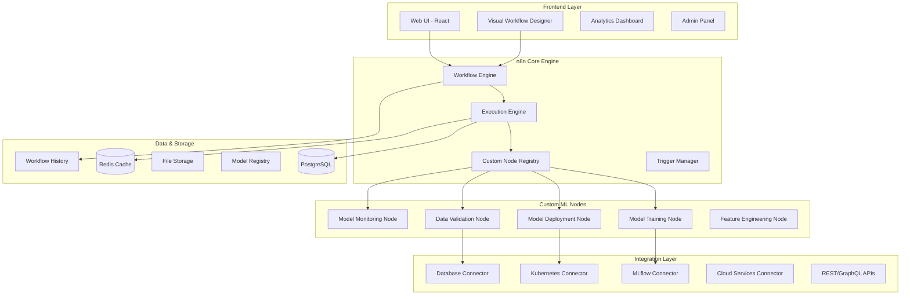

# 🔄 No-Code MLOps Automation Platform (n8n)

## Visual Workflow Builder for MLOps and Data Science Teams

**Duration:** 3-4 days | **Difficulty:** Advanced  
**Tech Stack:** n8n, Node.js, React, PostgreSQL, Redis, Docker, Kubernetes, Python

---

## 📋 **Project Overview**

This project implements a comprehensive **No-Code MLOps Automation Platform** built on n8n, designed to democratize MLOps workflows for data scientists, ML engineers, and business analysts. The platform provides visual workflow building capabilities for automating complex ML pipelines, model deployment, monitoring, and data processing tasks.

### **What This Platform Does**

The platform enables teams to:
- **Visual ML Workflows** - Drag-and-drop interface for building ML pipelines
- **Model Lifecycle Automation** - Automated model training, validation, and deployment
- **Data Pipeline Orchestration** - Visual data processing and ETL workflows
- **Monitoring & Alerting** - Automated model performance monitoring and alerts
- **Integration Hub** - Connect with 300+ services and ML platforms

---

## 🏗️ **Architecture Overview**



---

## 🎯 **Key Features**

### **Visual Workflow Building**
- ✅ **Drag-and-Drop Interface** - Intuitive visual workflow builder
- ✅ **Pre-built ML Nodes** - Ready-to-use nodes for common ML tasks
- ✅ **Custom Node Development** - SDK for building custom workflow nodes
- ✅ **Template Library** - Pre-built workflow templates for common use cases
- ✅ **Version Control** - Git-based workflow versioning and collaboration

### **MLOps Automation**
- ✅ **Automated Model Training** - Scheduled and triggered model training workflows
- ✅ **Model Deployment Pipeline** - Automated deployment to various platforms
- ✅ **A/B Testing Workflows** - Visual A/B testing and experiment management
- ✅ **Model Monitoring** - Automated model performance and drift monitoring
- ✅ **Data Quality Checks** - Automated data validation and quality monitoring

### **Integration Ecosystem**
- ✅ **300+ Connectors** - Pre-built connectors to popular services
- ✅ **MLOps Platform Integration** - MLflow, Kubeflow, Weights & Biases
- ✅ **Cloud Platform Support** - AWS, GCP, Azure native integrations
- ✅ **Database Connectivity** - All major databases and data warehouses
- ✅ **Real-time APIs** - REST, GraphQL, and WebSocket connectors

### **Enterprise Features**
- ✅ **Multi-tenant Architecture** - Team and organization management
- ✅ **Role-based Access Control** - Granular permissions and security
- ✅ **Audit Logging** - Comprehensive workflow execution logging
- ✅ **High Availability** - Clustered deployment with failover
- ✅ **Scalable Execution** - Horizontal scaling of workflow execution

---

## 📁 **Project Structure**

```
project5_n8n_nocode_platform/
├── README.md                              # This file
├── docs/                                  # Documentation
│   ├── architecture.md                   # System architecture
│   ├── workflow-examples.md              # Workflow examples
│   ├── custom-nodes.md                   # Custom node development
│   ├── deployment.md                     # Deployment guide
│   └── api-reference.md                  # API documentation
├── packages/                             # Core packages
│   ├── core/                            # Core n8n engine
│   │   ├── src/
│   │   │   ├── WorkflowEngine.ts         # Main workflow engine
│   │   │   ├── ExecutionEngine.ts        # Workflow execution
│   │   │   ├── NodeManager.ts            # Node lifecycle management
│   │   │   ├── TriggerManager.ts         # Trigger handling
│   │   │   └── WebhookManager.ts         # Webhook management
│   │   ├── test/                         # Core tests
│   │   └── package.json
│   ├── nodes-ml/                        # ML-specific nodes
│   │   ├── src/
│   │   │   ├── nodes/
│   │   │   │   ├── ModelTraining/        # Model training node
│   │   │   │   │   ├── ModelTraining.node.ts
│   │   │   │   │   ├── ModelTraining.node.json
│   │   │   │   │   └── description.ts
│   │   │   │   ├── ModelDeployment/      # Model deployment node
│   │   │   │   │   ├── ModelDeployment.node.ts
│   │   │   │   │   ├── ModelDeployment.node.json
│   │   │   │   │   └── description.ts
│   │   │   │   ├── DataValidation/       # Data validation node
│   │   │   │   │   ├── DataValidation.node.ts
│   │   │   │   │   ├── DataValidation.node.json
│   │   │   │   │   └── description.ts
│   │   │   │   ├── FeatureEngineering/   # Feature engineering node
│   │   │   │   │   ├── FeatureEngineering.node.ts
│   │   │   │   │   ├── FeatureEngineering.node.json
│   │   │   │   │   └── description.ts
│   │   │   │   ├── ModelMonitoring/      # Model monitoring node
│   │   │   │   │   ├── ModelMonitoring.node.ts
│   │   │   │   │   ├── ModelMonitoring.node.json
│   │   │   │   │   └── description.ts
│   │   │   │   └── HyperparameterTuning/ # Hyperparameter tuning
│   │   │   │       ├── HyperparameterTuning.node.ts
│   │   │   │       ├── HyperparameterTuning.node.json
│   │   │   │       └── description.ts
│   │   │   ├── credentials/              # Authentication credentials
│   │   │   │   ├── MLflowApi.credentials.ts
│   │   │   │   ├── KubernetesApi.credentials.ts
│   │   │   │   └── CloudML.credentials.ts
│   │   │   └── utils/                    # Utility functions
│   │   │       ├── mlUtils.ts
│   │   │       ├── dataUtils.ts
│   │   │       └── deploymentUtils.ts
│   │   ├── test/                         # ML nodes tests
│   │   └── package.json
│   ├── editor-ui/                       # Frontend editor
│   │   ├── src/
│   │   │   ├── components/
│   │   │   │   ├── WorkflowCanvas/       # Main workflow canvas
│   │   │   │   │   ├── WorkflowCanvas.vue
│   │   │   │   │   ├── NodeRenderer.vue
│   │   │   │   │   ├── ConnectionRenderer.vue
│   │   │   │   │   └── CanvasControls.vue
│   │   │   │   ├── NodePalette/          # Node selection palette
│   │   │   │   │   ├── NodePalette.vue
│   │   │   │   │   ├── NodeCategory.vue
│   │   │   │   │   └── NodeSearch.vue
│   │   │   │   ├── PropertyPanel/        # Node properties editor
│   │   │   │   │   ├── PropertyPanel.vue
│   │   │   │   │   ├── ParameterInput.vue
│   │   │   │   │   └── ExpressionEditor.vue
│   │   │   │   ├── ExecutionView/        # Workflow execution view
│   │   │   │   │   ├── ExecutionHistory.vue
│   │   │   │   │   ├── ExecutionDetails.vue
│   │   │   │   │   └── LogViewer.vue
│   │   │   │   ├── Dashboard/            # Analytics dashboard
│   │   │   │   │   ├── WorkflowMetrics.vue
│   │   │   │   │   ├── ExecutionStats.vue
│   │   │   │   │   ├── PerformanceCharts.vue
│   │   │   │   │   └── AlertsPanel.vue
│   │   │   │   └── Templates/            # Workflow templates
│   │   │   │       ├── TemplateGallery.vue
│   │   │   │       ├── TemplateCard.vue
│   │   │   │       └── TemplateImporter.vue
│   │   │   ├── stores/                   # Vuex stores
│   │   │   │   ├── workflows.ts
│   │   │   │   ├── nodes.ts
│   │   │   │   ├── executions.ts
│   │   │   │   └── ui.ts
│   │   │   ├── services/                 # API services
│   │   │   │   ├── workflowService.ts
│   │   │   │   ├── nodeService.ts
│   │   │   │   └── executionService.ts
│   │   │   ├── utils/                    # Frontend utilities
│   │   │   └── styles/                   # CSS styles
│   │   ├── public/
│   │   ├── test/                         # Frontend tests
│   │   ├── package.json
│   │   └── vite.config.ts
│   └── cli/                             # Command line interface
│       ├── src/
│       │   ├── commands/
│       │   │   ├── start.ts              # Start server command
│       │   │   ├── import.ts             # Import workflows
│       │   │   ├── export.ts             # Export workflows
│       │   │   └── execute.ts            # Execute workflow
│       │   ├── utils/
│       │   └── index.ts
│       ├── test/
│       └── package.json
├── workflows/                           # Example workflows
│   ├── templates/                       # Workflow templates
│   │   ├── ml-training-pipeline.json    # ML training template
│   │   ├── model-deployment.json        # Model deployment template
│   │   ├── data-validation.json         # Data validation template
│   │   ├── ab-testing.json              # A/B testing template
│   │   └── monitoring-alerts.json       # Monitoring template
│   └── examples/                        # Example workflows
│       ├── fraud-detection-training.json
│       ├── recommendation-deployment.json
│       └── data-quality-monitoring.json
├── docker/                              # Docker configurations
│   ├── Dockerfile.base                  # Base image
│   ├── Dockerfile.web                   # Web application
│   ├── Dockerfile.worker                # Background worker
│   ├── docker-compose.yml               # Local development
│   ├── docker-compose.prod.yml          # Production setup
│   └── init-scripts/                    # Initialization scripts
│       ├── init-db.sql
│       └── setup-redis.sh
├── kubernetes/                          # Kubernetes manifests
│   ├── namespace.yaml
│   ├── configmap.yaml
│   ├── secrets.yaml
│   ├── deployment/                      # Deployments
│   │   ├── web.yaml
│   │   ├── worker.yaml
│   │   ├── postgres.yaml
│   │   └── redis.yaml
│   ├── services/                        # Services
│   │   ├── web-service.yaml
│   │   ├── postgres-service.yaml
│   │   └── redis-service.yaml
│   ├── ingress/                         # Ingress configurations
│   │   └── ingress.yaml
│   └── monitoring/                      # Monitoring setup
│       ├── prometheus.yaml
│       └── grafana.yaml
├── helm/                                # Helm charts
│   └── n8n-mlops/
│       ├── Chart.yaml
│       ├── values.yaml
│       ├── templates/
│       └── charts/
├── tests/                               # Test suites
│   ├── unit/                           # Unit tests
│   ├── integration/                    # Integration tests
│   ├── e2e/                           # End-to-end tests
│   └── fixtures/                       # Test fixtures
├── scripts/                             # Automation scripts
│   ├── setup.sh                         # Environment setup
│   ├── build.sh                         # Build script
│   ├── deploy.sh                        # Deployment script
│   ├── backup.sh                        # Backup workflows
│   └── migrate.sh                       # Database migration
├── monitoring/                          # Monitoring configurations
│   ├── prometheus/                      # Prometheus configs
│   ├── grafana/                         # Grafana dashboards
│   ├── alerting/                        # Alert rules
│   └── logs/                           # Log configurations
├── docs-site/                          # Documentation website
│   ├── src/
│   ├── static/
│   ├── package.json
│   └── docusaurus.config.js
├── .github/workflows/                   # CI/CD pipelines
│   ├── test.yml                         # Testing pipeline
│   ├── build.yml                        # Build pipeline
│   ├── deploy.yml                       # Deployment pipeline
│   └── security.yml                     # Security scanning
├── package.json                         # Root package configuration
├── lerna.json                           # Lerna monorepo configuration
├── tsconfig.json                        # TypeScript configuration
├── jest.config.js                       # Jest test configuration
├── .eslintrc.js                         # ESLint configuration
├── .prettierrc                          # Prettier configuration
├── .env.example                         # Environment variables
└── docker-compose.yml                   # Development environment
```

---

## 🚀 **Quick Start**

### **Prerequisites**
```bash
# Required tools
- Node.js 18+
- Docker & Docker Compose
- PostgreSQL 13+
- Redis 6+
- Git
```

### **1. Clone and Setup**
```bash
# Clone the repository
git clone <repository-url>
cd project5_n8n_nocode_platform

# Install dependencies
npm install

# Setup environment variables
cp .env.example .env
# Edit .env with your configuration
```

### **2. Start Development Environment**
```bash
# Start infrastructure services
docker-compose up -d postgres redis

# Initialize database
npm run db:migrate

# Start development server
npm run dev

# Start worker process
npm run dev:worker
```

### **3. Access the Platform**
```bash
# Web interface
open http://localhost:5678

# API documentation
open http://localhost:5678/docs

# Health check
curl http://localhost:5678/health
```

### **4. Create Your First Workflow**
1. Open the web interface at http://localhost:5678
2. Click "New Workflow"
3. Drag ML nodes from the palette
4. Configure node parameters
5. Connect nodes to create workflow
6. Save and execute workflow

---

## 🔧 **Core Components**

### **1. Visual Workflow Designer**
Intuitive drag-and-drop interface for building complex ML workflows.

**Features:**
- Canvas-based workflow editor with zoom and pan
- Node palette with categorized ML operations
- Visual connection system with data flow indicators
- Real-time workflow validation and error highlighting
- Collaborative editing with conflict resolution

### **2. Custom ML Node Library**
Comprehensive library of ML-specific workflow nodes.

**Available Nodes:**
- **Data Processing**: Data validation, cleaning, transformation
- **Feature Engineering**: Feature selection, scaling, encoding
- **Model Training**: Support for all major ML frameworks
- **Model Evaluation**: Automated testing and validation
- **Model Deployment**: Deploy to various platforms and environments
- **Monitoring**: Model performance and drift detection

### **3. Execution Engine**
Scalable workflow execution with support for parallel processing.

**Capabilities:**
- Distributed workflow execution
- Queue-based job management
- Error handling and retry logic
- Resource allocation and optimization
- Real-time execution monitoring

### **4. Integration Hub**
Extensive connectivity to external systems and services.

**Integrations:**
- **ML Platforms**: MLflow, Weights & Biases, Kubeflow
- **Cloud Services**: AWS SageMaker, Google AI Platform, Azure ML
- **Databases**: PostgreSQL, MySQL, MongoDB, BigQuery
- **Data Sources**: APIs, file systems, streaming platforms
- **Notification**: Slack, email, webhooks, SMS

---

## 🤖 **Custom ML Nodes**

### **Model Training Node**
```typescript
// Example: Model Training Node Configuration
{
  "displayName": "Train ML Model",
  "name": "modelTraining",
  "group": ["ml"],
  "version": 1,
  "description": "Train machine learning models with various algorithms",
  "defaults": {
    "name": "Train Model"
  },
  "inputs": ["main"],
  "outputs": ["main"],
  "properties": [
    {
      "displayName": "Algorithm",
      "name": "algorithm",
      "type": "options",
      "options": [
        {"name": "Random Forest", "value": "random_forest"},
        {"name": "XGBoost", "value": "xgboost"},
        {"name": "Neural Network", "value": "neural_network"}
      ],
      "default": "random_forest"
    },
    {
      "displayName": "Training Data",
      "name": "trainingData",
      "type": "string",
      "required": true,
      "placeholder": "path/to/training/data.csv"
    },
    {
      "displayName": "Hyperparameters",
      "name": "hyperparameters",
      "type": "json",
      "default": "{}"
    }
  ]
}
```

### **Model Deployment Node**
```typescript
// Example: Model Deployment Configuration
{
  "displayName": "Deploy Model",
  "name": "modelDeployment",
  "group": ["ml"],
  "description": "Deploy trained models to various platforms",
  "properties": [
    {
      "displayName": "Deployment Target",
      "name": "target",
      "type": "options",
      "options": [
        {"name": "Kubernetes", "value": "kubernetes"},
        {"name": "AWS Lambda", "value": "aws_lambda"},
        {"name": "Docker Container", "value": "docker"}
      ]
    },
    {
      "displayName": "Model Path",
      "name": "modelPath",
      "type": "string",
      "required": true
    },
    {
      "displayName": "Scaling Configuration",
      "name": "scaling",
      "type": "json",
      "default": "{\"min_replicas\": 1, \"max_replicas\": 10}"
    }
  ]
}
```

---

## 📊 **Workflow Templates**

### **ML Training Pipeline Template**
```json
{
  "name": "ML Training Pipeline",
  "description": "Complete ML model training workflow",
  "nodes": [
    {
      "name": "Data Validation",
      "type": "dataValidation",
      "position": [100, 100],
      "parameters": {
        "schema": "ml_training_schema.json",
        "checks": ["completeness", "validity", "uniqueness"]
      }
    },
    {
      "name": "Feature Engineering",
      "type": "featureEngineering",
      "position": [300, 100],
      "parameters": {
        "operations": ["scaling", "encoding", "selection"],
        "target_column": "target"
      }
    },
    {
      "name": "Model Training",
      "type": "modelTraining",
      "position": [500, 100],
      "parameters": {
        "algorithm": "xgboost",
        "hyperparameters": {
          "n_estimators": 100,
          "max_depth": 6,
          "learning_rate": 0.1
        }
      }
    },
    {
      "name": "Model Evaluation",
      "type": "modelEvaluation",
      "position": [700, 100],
      "parameters": {
        "metrics": ["accuracy", "precision", "recall", "f1"],
        "validation_split": 0.2
      }
    },
    {
      "name": "Model Registry",
      "type": "modelRegistry",
      "position": [900, 100],
      "parameters": {
        "registry_url": "mlflow://localhost:5000",
        "model_name": "fraud_detection_model"
      }
    }
  ],
  "connections": [
    {"source": "Data Validation", "target": "Feature Engineering"},
    {"source": "Feature Engineering", "target": "Model Training"},
    {"source": "Model Training", "target": "Model Evaluation"},
    {"source": "Model Evaluation", "target": "Model Registry"}
  ]
}
```

### **Model Monitoring Template**
```json
{
  "name": "Model Monitoring Pipeline",
  "description": "Continuous model performance monitoring",
  "trigger": {
    "type": "schedule",
    "interval": "*/30 * * * *"
  },
  "nodes": [
    {
      "name": "Fetch Predictions",
      "type": "dataSource",
      "parameters": {
        "source": "prediction_database",
        "query": "SELECT * FROM predictions WHERE created_at > NOW() - INTERVAL '30 minutes'"
      }
    },
    {
      "name": "Data Drift Detection",
      "type": "driftDetection",
      "parameters": {
        "reference_data": "training_data.csv",
        "threshold": 0.1,
        "method": "kolmogorov_smirnov"
      }
    },
    {
      "name": "Performance Metrics",
      "type": "performanceMetrics",
      "parameters": {
        "metrics": ["accuracy", "latency", "throughput"],
        "alert_thresholds": {
          "accuracy": 0.85,
          "latency": 100,
          "throughput": 1000
        }
      }
    },
    {
      "name": "Alert Notification",
      "type": "notification",
      "parameters": {
        "channels": ["slack", "email"],
        "conditions": "accuracy < 0.85 OR latency > 100"
      }
    }
  ]
}
```

---

## 🎯 **Example Workflows**

### **Fraud Detection Training Workflow**
```javascript
// Complete fraud detection model training workflow
const fraudDetectionWorkflow = {
  name: "Fraud Detection Training",
  description: "Train and deploy fraud detection model",
  schedule: "0 2 * * *", // Daily at 2 AM
  
  steps: [
    {
      name: "data_extraction",
      node: "DatabaseQuery",
      config: {
        query: `
          SELECT user_id, transaction_amount, merchant_category, 
                 location, timestamp, is_fraud
          FROM transactions 
          WHERE DATE(timestamp) = CURRENT_DATE - 1
        `,
        database: "production_db"
      }
    },
    {
      name: "data_preprocessing",
      node: "DataPreprocessing",
      config: {
        operations: ["handle_missing", "feature_engineering", "scaling"],
        target_column: "is_fraud"
      }
    },
    {
      name: "model_training",
      node: "ModelTraining",
      config: {
        algorithm: "xgboost",
        hyperparameters: {
          n_estimators: 200,
          max_depth: 8,
          learning_rate: 0.05,
          subsample: 0.8
        },
        validation_split: 0.2
      }
    },
    {
      name: "model_evaluation",
      node: "ModelEvaluation",
      config: {
        metrics: ["auc_roc", "precision", "recall", "f1"],
        threshold_optimization: true
      }
    },
    {
      name: "model_deployment",
      node: "ModelDeployment",
      config: {
        target: "kubernetes",
        service_name: "fraud-detection-api",
        replicas: 3,
        auto_scaling: true
      },
      condition: "model_evaluation.auc_roc > 0.92"
    }
  ]
};
```

### **A/B Testing Workflow**
```javascript
// A/B testing workflow for recommendation systems
const abTestingWorkflow = {
  name: "Recommendation A/B Test",
  description: "Test new recommendation algorithm",
  
  steps: [
    {
      name: "user_segmentation",
      node: "UserSegmentation",
      config: {
        criteria: "active_users_last_30_days",
        split_ratio: {"control": 0.5, "treatment": 0.5},
        randomization_unit: "user_id"
      }
    },
    {
      name: "deploy_control_model",
      node: "ModelDeployment",
      config: {
        model_path: "models/recommendation_v1",
        target_segment: "control",
        traffic_percentage: 50
      }
    },
    {
      name: "deploy_treatment_model",
      node: "ModelDeployment",
      config: {
        model_path: "models/recommendation_v2",
        target_segment: "treatment",
        traffic_percentage: 50
      }
    },
    {
      name: "metrics_collection",
      node: "MetricsCollection",
      config: {
        metrics: ["click_through_rate", "conversion_rate", "session_duration"],
        collection_period: "7_days"
      }
    },
    {
      name: "statistical_analysis",
      node: "StatisticalTest",
      config: {
        test_type: "t_test",
        confidence_level: 0.95,
        minimum_sample_size: 10000
      }
    },
    {
      name: "decision_engine",
      node: "DecisionEngine",
      config: {
        decision_criteria: "statistical_significance AND practical_significance",
        rollout_strategy: "gradual_rollout"
      }
    }
  ]
};
```

---

## 🛠️ **Advanced Features**

### **Custom Node Development**
```typescript
// Example: Custom sentiment analysis node
import { IExecuteFunctions } from 'n8n-workflow';
import { INodeExecutionData, INodeType, INodeTypeDescription } from 'n8n-workflow';

export class SentimentAnalysis implements INodeType {
  description: INodeTypeDescription = {
    displayName: 'Sentiment Analysis',
    name: 'sentimentAnalysis',
    group: ['ml'],
    version: 1,
    description: 'Perform sentiment analysis on text data',
    defaults: {
      name: 'Sentiment Analysis',
    },
    inputs: ['main'],
    outputs: ['main'],
    properties: [
      {
        displayName: 'Text Field',
        name: 'textField',
        type: 'string',
        default: 'text',
        required: true,
        description: 'Field containing text to analyze',
      },
      {
        displayName: 'Model Type',
        name: 'modelType',
        type: 'options',
        options: [
          { name: 'VADER', value: 'vader' },
          { name: 'TextBlob', value: 'textblob' },
          { name: 'Transformers', value: 'transformers' },
        ],
        default: 'vader',
      },
    ],
  };

  async execute(this: IExecuteFunctions): Promise<INodeExecutionData[][]> {
    const items = this.getInputData();
    const returnData: INodeExecutionData[] = [];

    for (let i = 0; i < items.length; i++) {
      const textField = this.getNodeParameter('textField', i) as string;
      const modelType = this.getNodeParameter('modelType', i) as string;
      
      const text = items[i].json[textField] as string;
      
      // Perform sentiment analysis
      const sentiment = await this.performSentimentAnalysis(text, modelType);
      
      returnData.push({
        json: {
          ...items[i].json,
          sentiment_score: sentiment.score,
          sentiment_label: sentiment.label,
          confidence: sentiment.confidence,
        },
      });
    }

    return [returnData];
  }

  private async performSentimentAnalysis(text: string, model: string) {
    // Implementation would call appropriate ML service
    // This is a simplified example
    return {
      score: Math.random() * 2 - 1, // -1 to 1
      label: Math.random() > 0.5 ? 'positive' : 'negative',
      confidence: Math.random(),
    };
  }
}
```

### **Workflow Versioning & GitOps**
```yaml
# .github/workflows/workflow-deployment.yml
name: Deploy Workflows

on:
  push:
    branches: [main]
    paths: ['workflows/**']

jobs:
  deploy-workflows:
    runs-on: ubuntu-latest
    
    steps:
    - uses: actions/checkout@v3
    
    - name: Setup Node.js
      uses: actions/setup-node@v3
      with:
        node-version: '18'
    
    - name: Install n8n CLI
      run: npm install -g n8n
    
    - name: Validate Workflows
      run: |
        for workflow in workflows/templates/*.json; do
          n8n workflow:validate "$workflow"
        done
    
    - name: Deploy to Staging
      run: |
        for workflow in workflows/templates/*.json; do
          n8n workflow:import "$workflow" --url ${{ secrets.N8N_STAGING_URL }}
        done
    
    - name: Run Integration Tests
      run: npm run test:integration
    
    - name: Deploy to Production
      if: success()
      run: |
        for workflow in workflows/templates/*.json; do
          n8n workflow:import "$workflow" --url ${{ secrets.N8N_PRODUCTION_URL }}
        done
```

---

## 📈 **Monitoring & Analytics**

### **Workflow Performance Dashboard**
```typescript
// Real-time workflow analytics
interface WorkflowMetrics {
  executionCount: number;
  successRate: number;
  averageExecutionTime: number;
  errorRate: number;
  resourceUsage: {
    cpu: number;
    memory: number;
    storage: number;
  };
  nodePerformance: {
    [nodeId: string]: {
      executionTime: number;
      successRate: number;
      errorCount: number;
    };
  };
}

class WorkflowAnalytics {
  async getWorkflowMetrics(workflowId: string, timeRange: string): Promise<WorkflowMetrics> {
    // Implementation for fetching and calculating metrics
    return {
      executionCount: 1247,
      successRate: 0.987,
      averageExecutionTime: 145000, // milliseconds
      errorRate: 0.013,
      resourceUsage: {
        cpu: 0.65,
        memory: 0.78,
        storage: 0.45
      },
      nodePerformance: {
        'data_validation': { executionTime: 5000, successRate: 0.999, errorCount: 2 },
        'model_training': { executionTime: 120000, successRate: 0.985, errorCount: 18 },
        'model_deployment': { executionTime: 15000, successRate: 0.995, errorCount: 6 }
      }
    };
  }
}
```

### **Cost Optimization**
```typescript
// Automatic cost optimization recommendations
class CostOptimizer {
  async analyzeWorkflowCosts(workflowId: string): Promise<OptimizationRecommendations> {
    return {
      currentCost: 245.67, // USD per month
      optimizedCost: 178.23,
      savings: 67.44,
      recommendations: [
        {
          type: 'resource_right_sizing',
          description: 'Reduce CPU allocation for data validation nodes',
          impact: 'Low',
          savings: 23.45
        },
        {
          type: 'execution_scheduling',
          description: 'Schedule training jobs during off-peak hours',
          impact: 'Medium',
          savings: 34.78
        },
        {
          type: 'node_optimization',
          description: 'Replace custom Python nodes with built-in alternatives',
          impact: 'High',
          savings: 9.21
        }
      ]
    };
  }
}
```

---

## 🚀 **Production Deployment**

### **Kubernetes Deployment**
```bash
# Deploy using Helm
helm install n8n-mlops ./helm/n8n-mlops \
  --namespace n8n-mlops \
  --create-namespace \
  --values production-values.yaml

# Scale workers based on load
kubectl autoscale deployment n8n-worker \
  --cpu-percent=70 \
  --min=3 \
  --max=50

# Monitor deployment
kubectl get pods -n n8n-mlops
kubectl logs -f deployment/n8n-web -n n8n-mlops
```

### **High Availability Setup**
```yaml
# production-values.yaml
replicaCount:
  web: 3
  worker: 5

autoscaling:
  enabled: true
  minReplicas: 3
  maxReplicas: 50
  targetCPUUtilizationPercentage: 70

postgresql:
  enabled: true
  replication:
    enabled: true
    slaveReplicas: 2

redis:
  enabled: true
  cluster:
    enabled: true
    slaveCount: 3

monitoring:
  enabled: true
  prometheus:
    enabled: true
  grafana:
    enabled: true
```

---

## 🎓 **Learning Outcomes**

By building this project, you'll master:

### **No-Code Platform Development**
- Visual workflow engine architecture
- Drag-and-drop interface development
- Node-based programming paradigms
- Real-time collaboration systems

### **MLOps Automation**
- Workflow orchestration for ML pipelines
- Automated model lifecycle management
- Integration with MLOps platforms
- Monitoring and alerting automation

### **Enterprise Software Engineering**
- Multi-tenant SaaS architecture
- Microservices design patterns
- Event-driven architecture
- API design and integration

### **Advanced Frontend Development**
- Vue.js/React component architecture
- Canvas-based interactive applications
- Real-time data visualization
- Performance optimization techniques

---

## 🤝 **Contributing**

This project follows modern development practices:
- TypeScript for type safety
- Comprehensive test coverage (>90%)
- ESLint and Prettier for code quality
- Automated CI/CD with GitHub Actions
- Semantic versioning and changelog

Ready to democratize MLOps with visual workflow automation? Let's build the future of no-code ML! 🚀

---

## 🎉 **Next Steps**

1. **[Quick Start](#quick-start)** - Set up your development environment
2. **[Build Custom Nodes](#custom-ml-nodes)** - Create domain-specific workflow nodes
3. **[Deploy Workflows](#workflow-templates)** - Use pre-built templates for common tasks
4. **[Scale to Production](#production-deployment)** - Deploy enterprise-ready platform

Transform your team's productivity with visual MLOps automation! 🎨🤖✨