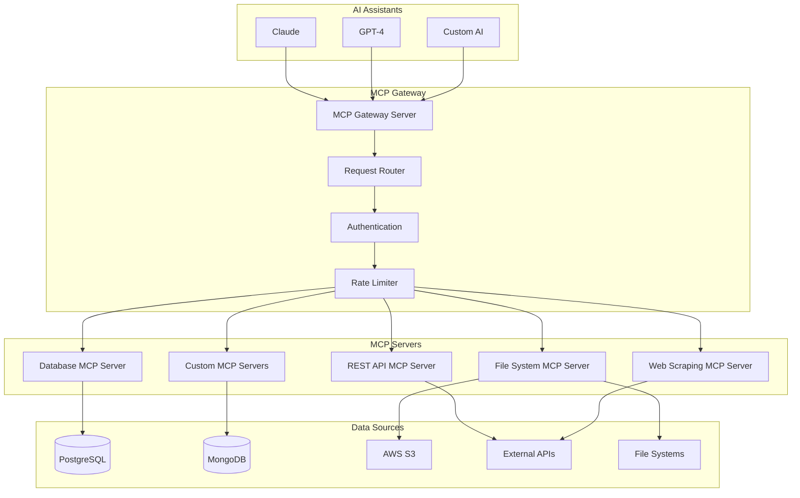

# 🔌 Model Context Protocol (MCP) Servers Platform

## Production-Grade MCP Implementation for AI Assistant Integrations

**Duration:** 4-5 days | **Difficulty:** Expert  
**Tech Stack:** Python, TypeScript, FastAPI, WebSockets, Docker, Kubernetes, PostgreSQL, Redis

---

## 📋 **Project Overview**

This project implements a comprehensive **Model Context Protocol (MCP) Servers Platform** following Anthropic's open standard for connecting AI assistants to external data sources and tools. The platform provides a production-ready infrastructure for building, deploying, and managing MCP servers at scale.

### **What is Model Context Protocol (MCP)?**

MCP is Anthropic's open standard that enables AI assistants to securely connect to external data sources and tools. It provides:
- **Standardized Communication** - Consistent protocol for AI-data integration
- **Security First** - Built-in authentication and permission management
- **Extensibility** - Plugin architecture for custom integrations
- **Interoperability** - Works across different AI assistants and platforms

---

## 🏗️ **Architecture Overview**



---

## 🎯 **Key Features**

### **Core MCP Implementation**
- ✅ **Complete MCP Protocol** - Full implementation of Anthropic's MCP specification
- ✅ **WebSocket & HTTP Support** - Multiple transport protocols for AI assistant connections
- ✅ **Authentication & Authorization** - JWT-based security with role-based access control
- ✅ **Request Routing** - Intelligent routing to appropriate MCP servers
- ✅ **Error Handling** - Comprehensive error management and recovery

### **Production Features**
- ✅ **High Availability** - Load balancing and failover mechanisms
- ✅ **Scalability** - Horizontal scaling with Kubernetes
- ✅ **Monitoring** - Comprehensive observability with Prometheus and Grafana
- ✅ **Rate Limiting** - Protection against abuse and resource exhaustion
- ✅ **Caching** - Redis-based caching for improved performance

### **Developer Experience**
- ✅ **SDK Generation** - Auto-generated SDKs for multiple languages
- ✅ **Interactive Testing** - Web-based MCP server testing interface
- ✅ **Documentation** - Auto-generated API documentation
- ✅ **Plugin Architecture** - Easy integration of custom MCP servers
- ✅ **Hot Reloading** - Development-friendly server reloading

---

## 📁 **Project Structure**

```
project7_mcp_servers_platform/
├── README.md                           # This file
├── docs/                              # Documentation
│   ├── architecture.md               # System architecture
│   ├── mcp-protocol.md              # MCP protocol specification
│   ├── api-reference.md             # API documentation
│   └── deployment.md                # Deployment guide
├── src/                              # Source code
│   ├── mcp_gateway/                  # MCP Gateway Server
│   │   ├── __init__.py
│   │   ├── main.py                   # FastAPI application
│   │   ├── protocol/                 # MCP protocol implementation
│   │   │   ├── __init__.py
│   │   │   ├── handler.py           # Protocol message handling
│   │   │   ├── transport.py         # WebSocket/HTTP transport
│   │   │   └── validation.py        # Message validation
│   │   ├── auth/                     # Authentication & authorization
│   │   │   ├── __init__.py
│   │   │   ├── jwt_handler.py       # JWT token management
│   │   │   ├── permissions.py       # Permission management
│   │   │   └── middleware.py        # Auth middleware
│   │   ├── routing/                  # Request routing
│   │   │   ├── __init__.py
│   │   │   ├── router.py            # Main routing logic
│   │   │   ├── load_balancer.py     # Load balancing
│   │   │   └── discovery.py         # Service discovery
│   │   ├── monitoring/               # Monitoring & metrics
│   │   │   ├── __init__.py
│   │   │   ├── metrics.py           # Prometheus metrics
│   │   │   ├── health.py            # Health checks
│   │   │   └── logging.py           # Structured logging
│   │   └── utils/                    # Utilities
│   │       ├── __init__.py
│   │       ├── config.py            # Configuration management
│   │       └── exceptions.py        # Custom exceptions
│   ├── mcp_servers/                  # MCP Server Implementations
│   │   ├── __init__.py
│   │   ├── base/                     # Base MCP server framework
│   │   │   ├── __init__.py
│   │   │   ├── server.py            # Base server class
│   │   │   ├── tools.py             # Tool management
│   │   │   ├── resources.py         # Resource management
│   │   │   └── prompts.py           # Prompt management
│   │   ├── database/                 # Database MCP server
│   │   │   ├── __init__.py
│   │   │   ├── postgresql_server.py # PostgreSQL integration
│   │   │   ├── mongodb_server.py    # MongoDB integration
│   │   │   ├── query_builder.py     # Safe query building
│   │   │   └── schema_inspector.py  # Database schema inspection
│   │   ├── filesystem/               # File system MCP server
│   │   │   ├── __init__.py
│   │   │   ├── local_server.py      # Local file system
│   │   │   ├── s3_server.py         # AWS S3 integration
│   │   │   ├── security.py          # File access security
│   │   │   └── indexing.py          # File indexing
│   │   ├── api/                      # REST API MCP server
│   │   │   ├── __init__.py
│   │   │   ├── rest_server.py       # REST API integration
│   │   │   ├── graphql_server.py    # GraphQL integration
│   │   │   ├── auth_handler.py      # API authentication
│   │   │   └── rate_limiter.py      # API rate limiting
│   │   ├── web/                      # Web scraping MCP server
│   │   │   ├── __init__.py
│   │   │   ├── scraper_server.py    # Web scraping
│   │   │   ├── content_parser.py    # Content parsing
│   │   │   ├── robots_parser.py     # Robots.txt compliance
│   │   │   └── cache_manager.py     # Scraping cache
│   │   └── ml/                       # ML/AI MCP server
│   │       ├── __init__.py
│   │       ├── model_server.py      # ML model integration
│   │       ├── vector_db_server.py  # Vector database integration
│   │       ├── embedding_server.py  # Embedding generation
│   │       └── inference_server.py  # Model inference
│   ├── client/                       # MCP Client SDK
│   │   ├── __init__.py
│   │   ├── python/                   # Python client SDK
│   │   │   ├── __init__.py
│   │   │   ├── client.py            # Main client class
│   │   │   ├── transport.py         # Transport implementation
│   │   │   └── types.py             # Type definitions
│   │   ├── typescript/               # TypeScript client SDK
│   │   │   ├── src/
│   │   │   │   ├── client.ts        # Main client class
│   │   │   │   ├── transport.ts     # Transport implementation
│   │   │   │   └── types.ts         # Type definitions
│   │   │   ├── package.json
│   │   │   └── tsconfig.json
│   │   └── examples/                 # Client examples
│   │       ├── python_example.py
│   │       └── typescript_example.ts
│   ├── web_ui/                       # Web-based testing interface
│   │   ├── __init__.py
│   │   ├── app.py                    # Streamlit/FastAPI web app
│   │   ├── components/               # UI components
│   │   ├── static/                   # Static assets
│   │   └── templates/                # HTML templates
│   └── shared/                       # Shared utilities
│       ├── __init__.py
│       ├── models.py                 # Pydantic models
│       ├── constants.py              # Constants
│       ├── utils.py                  # Utility functions
│       └── types.py                  # Type definitions
├── tests/                            # Test suites
│   ├── unit/                         # Unit tests
│   ├── integration/                  # Integration tests
│   ├── performance/                  # Performance tests
│   └── fixtures/                     # Test fixtures
├── deployment/                       # Deployment configurations
│   ├── kubernetes/                   # Kubernetes manifests
│   │   ├── namespace.yaml
│   │   ├── gateway/                  # Gateway deployment
│   │   ├── servers/                  # MCP servers deployment
│   │   ├── monitoring/               # Monitoring stack
│   │   └── ingress/                  # Ingress configuration
│   ├── helm/                         # Helm charts
│   │   ├── mcp-platform/
│   │   └── monitoring/
│   ├── docker/                       # Docker configurations
│   │   ├── gateway.Dockerfile
│   │   ├── servers.Dockerfile
│   │   └── docker-compose.yml
│   └── terraform/                    # Infrastructure as Code
│       ├── main.tf
│       ├── variables.tf
│       └── outputs.tf
├── monitoring/                       # Monitoring & observability
│   ├── prometheus/                   # Prometheus configuration
│   ├── grafana/                      # Grafana dashboards
│   ├── alerting/                     # Alert rules
│   └── logging/                      # Log aggregation
├── scripts/                          # Automation scripts
│   ├── setup.sh                      # Environment setup
│   ├── deploy.sh                     # Deployment script
│   ├── test.sh                       # Test execution
│   └── generate-sdk.py               # SDK generation
├── examples/                         # Usage examples
│   ├── basic_usage/                  # Basic usage examples
│   ├── advanced_patterns/            # Advanced usage patterns
│   ├── custom_servers/               # Custom MCP server examples
│   └── ai_integrations/              # AI assistant integrations
├── .github/workflows/                # CI/CD pipelines
│   ├── test.yml                      # Testing pipeline
│   ├── build.yml                     # Build pipeline
│   ├── deploy.yml                    # Deployment pipeline
│   └── security.yml                  # Security scanning
├── requirements.txt                  # Python dependencies
├── requirements-dev.txt              # Development dependencies
├── pyproject.toml                    # Python project configuration
├── Makefile                          # Development tasks
└── .env.example                      # Environment variables template
```

---

## 🚀 **Quick Start**

### **Prerequisites**
```bash
# Required tools
- Python 3.9+
- Node.js 16+ (for TypeScript SDK)
- Docker & Docker Compose
- Kubernetes cluster (local or cloud)
- PostgreSQL
- Redis
```

### **1. Clone and Setup**
```bash
# Clone the repository
git clone <repository-url>
cd project7_mcp_servers_platform

# Setup Python environment
python -m venv venv
source venv/bin/activate  # On Windows: venv\Scripts\activate
pip install -r requirements.txt

# Setup environment variables
cp .env.example .env
# Edit .env with your configuration
```

### **2. Start Development Environment**
```bash
# Start infrastructure services
docker-compose up -d postgres redis

# Initialize database
python scripts/init_db.py

# Start MCP Gateway
python -m src.mcp_gateway.main

# Start example MCP servers
python -m src.mcp_servers.database.postgresql_server
python -m src.mcp_servers.filesystem.local_server
```

### **3. Test MCP Integration**
```bash
# Test with Python client
python examples/basic_usage/test_connection.py

# Test with web interface
python -m src.web_ui.app
# Open http://localhost:8501
```

---

## 🔧 **Core Components**

### **1. MCP Gateway Server**
Central hub that handles AI assistant connections and routes requests to appropriate MCP servers.

**Key Features:**
- WebSocket and HTTP transport support
- JWT-based authentication
- Request routing and load balancing
- Rate limiting and caching
- Comprehensive monitoring

### **2. MCP Server Framework**
Base framework for building custom MCP servers with built-in security, monitoring, and best practices.

**Built-in MCP Servers:**
- **Database Server** - PostgreSQL, MongoDB, MySQL integration
- **Filesystem Server** - Local files, AWS S3, Google Cloud Storage
- **API Server** - REST and GraphQL API integration
- **Web Server** - Web scraping with content parsing
- **ML Server** - Model inference and vector database integration

### **3. Client SDKs**
Auto-generated SDKs for easy integration with AI assistants.

**Supported Languages:**
- Python (asyncio and sync)
- TypeScript/JavaScript
- More languages via OpenAPI generation

### **4. Web Testing Interface**
Interactive web interface for testing MCP servers and debugging integrations.

---

## 📊 **Production Features**

### **High Availability**
- Load balancing across multiple MCP servers
- Automatic failover and health checks
- Circuit breaker pattern for external dependencies
- Graceful degradation under load

### **Security**
- JWT-based authentication with role-based access control
- Input validation and sanitization
- Rate limiting and DDoS protection
- Audit logging for all operations

### **Monitoring & Observability**
- Prometheus metrics collection
- Grafana dashboards for visualization
- Distributed tracing with Jaeger
- Structured logging with correlation IDs

### **Performance**
- Redis caching for frequently accessed data
- Connection pooling for database operations
- Async processing for high concurrency
- Request batching and optimization

---

## 🎯 **AI Assistant Integrations**

### **Claude Integration**
```python
from mcp_client import MCPClient

# Connect to MCP Gateway
client = MCPClient("ws://localhost:8000/mcp")
await client.authenticate(token="your-jwt-token")

# List available tools
tools = await client.list_tools()

# Call a tool
result = await client.call_tool(
    name="database_query",
    arguments={"query": "SELECT * FROM users WHERE active = true"}
)
```

### **Custom AI Assistant Integration**
```typescript
import { MCPClient } from '@mcp/client';

const client = new MCPClient('ws://localhost:8000/mcp');
await client.connect();

// Subscribe to resources
await client.subscribe('filesystem://documents/*');

// Handle resource updates
client.on('resource_updated', (resource) => {
    console.log('Resource updated:', resource);
});
```

---

## 🔌 **Custom MCP Server Development**

### **Creating a Custom MCP Server**
```python
from src.mcp_servers.base import BaseMCPServer
from src.shared.models import Tool, Resource

class CustomMCPServer(BaseMCPServer):
    def __init__(self):
        super().__init__(name="custom-server", version="1.0.0")
        
    async def list_tools(self) -> List[Tool]:
        return [
            Tool(
                name="custom_operation",
                description="Performs a custom operation",
                input_schema={
                    "type": "object",
                    "properties": {
                        "param1": {"type": "string"},
                        "param2": {"type": "integer"}
                    }
                }
            )
        ]
    
    async def call_tool(self, name: str, arguments: dict) -> dict:
        if name == "custom_operation":
            return await self.custom_operation(**arguments)
        raise ValueError(f"Unknown tool: {name}")
    
    async def custom_operation(self, param1: str, param2: int) -> dict:
        # Custom logic here
        return {"result": f"Processed {param1} with {param2}"}

# Register and start server
if __name__ == "__main__":
    server = CustomMCPServer()
    server.run(host="0.0.0.0", port=8001)
```

---

## 📈 **Deployment**

### **Local Development**
```bash
# Start with Docker Compose
docker-compose up -d

# Or start individual components
make start-gateway
make start-servers
make start-monitoring
```

### **Kubernetes Production**
```bash
# Deploy with Helm
helm install mcp-platform ./deployment/helm/mcp-platform

# Or with kubectl
kubectl apply -f deployment/kubernetes/

# Monitor deployment
kubectl get pods -n mcp-platform
```

### **Cloud Deployment**
```bash
# Deploy infrastructure with Terraform
cd deployment/terraform
terraform init
terraform plan
terraform apply

# Deploy application
make deploy-prod
```

---

## 🧪 **Testing**

### **Run Test Suite**
```bash
# Run all tests
make test

# Run specific test categories
make test-unit
make test-integration
make test-performance

# Run with coverage
make test-coverage
```

### **Load Testing**
```bash
# Test gateway performance
python tests/performance/load_test_gateway.py

# Test specific MCP server
python tests/performance/load_test_database_server.py
```

---

## 📚 **Documentation**

- **[Architecture Guide](./docs/architecture.md)** - System design and components
- **[MCP Protocol Specification](./docs/mcp-protocol.md)** - Protocol implementation details
- **[API Reference](./docs/api-reference.md)** - Complete API documentation
- **[Deployment Guide](./docs/deployment.md)** - Production deployment instructions
- **[Development Guide](./docs/development.md)** - Developer setup and guidelines

---

## 🎓 **Learning Outcomes**

By building this project, you'll master:

### **Protocol Implementation**
- Deep understanding of Anthropic's Model Context Protocol
- WebSocket and HTTP transport implementation
- Message validation and error handling
- Protocol extensibility patterns

### **AI Integration Architecture**
- Designing systems for AI assistant integration
- Security considerations for AI-data connections
- Performance optimization for real-time AI interactions
- Scalable architecture for multiple AI assistants

### **Production Engineering**
- High-availability system design
- Load balancing and failover strategies
- Comprehensive monitoring and observability
- Security best practices for AI systems

---

## 🚀 **Next Steps**

1. **[Quick Start](#quick-start)** - Get the platform running locally
2. **[Build Custom MCP Server](#custom-mcp-server-development)** - Create your own integrations
3. **[Deploy to Production](#deployment)** - Scale to production workloads
4. **[Integrate with AI Assistants](#ai-assistant-integrations)** - Connect your favorite AI tools

---

## 🤝 **Contributing**

This project follows production-grade development practices:
- Comprehensive test coverage (>90%)
- Type hints and documentation
- CI/CD with automated testing
- Security scanning and code quality checks

Ready to build the future of AI-data integration? Let's get started! 🚀